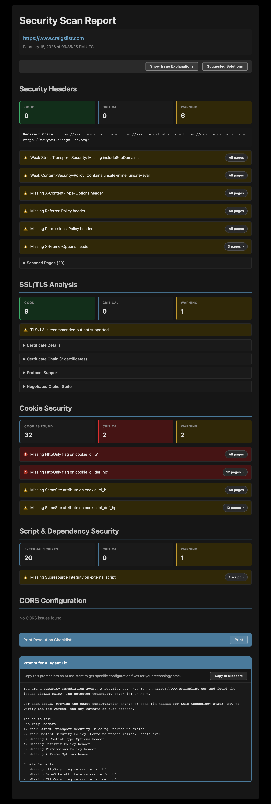
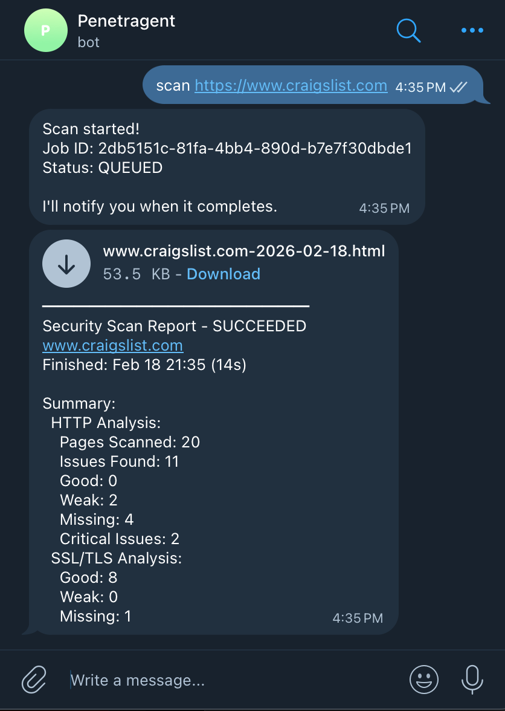

# Penetragent

A security scanning tool you control by sending text messages to a Telegram bot. You tell it "scan this website" and it checks whether the site has its security settings configured properly. It reports back with a grade card — like a health inspection for websites.



## Getting Started

Follow [these instructions](./docs/getting-started.md) to set up and run Penetragent locally or on a VPS.

## The Two Pieces

There are only two services:

**The Controller** is a Telegram chatbot. It's the interface — the only thing you talk to. It doesn't do any scanning itself. When you say `scan https://example.com`, it passes that request along to the scanner and then keeps checking back until the scan is done. When results are ready, it messages you.

**The Scanner** is the backend that does the real work. It has a small HTTP API (like a web server), a SQLite database to track jobs, and a background worker that picks up scan requests and executes them one at a time. You can also talk to it directly with curl if you don't want to use Telegram.

## What Happens When You Run a Scan



1. You DM the bot: `scan https://example.com` (or use curl directly)
2. The bot sends that request to the scanner's API
3. The scanner creates a job record in the database (status: QUEUED) and responds immediately
4. The bot tells you "Scan started!" and begins checking the job status every few seconds in the background
5. The scanner's worker notices the queued job and picks it up (status: RUNNING)
6. Before touching the target website, the worker resolves its hostname via DNS and checks that every IP address is public — not localhost, not an internal network address, not anything that could be used to probe infrastructure it shouldn't reach
7. If the IPs are safe, the worker runs the requested scan types (HTTP analysis, TLS analysis, or both)
8. For HTTP: it crawls up to 20 pages, grades security headers, checks cookies, analyzes external scripts, tests CORS configuration, and detects the technology stack
9. For TLS: it analyzes the SSL certificate, tests protocol versions (SSLv3 through TLS 1.3), and evaluates cipher suites
10. Results are saved to a JSON report and an HTML report is generated. A summary is written to the database (status: SUCCEEDED)
11. The bot's background poller sees the job is done and sends you the HTML report as a downloadable document in Telegram

## Scan Types

By default, `scan https://example.com` runs all scan types. You can also run them individually.

### HTTP Analysis (`http`)

A multi-page security audit. When you run `scan https://example.com http`, it:

- **Crawls your site** — Discovers and follows up to 20 pages from your target domain
- **Grades security headers** — Checks six headers (HSTS, CSP, X-Content-Type-Options, X-Frame-Options, Referrer-Policy, Permissions-Policy) as good, weak, or missing
- **Flags information leakage** — Headers like `Server: Apache/2.4.51` that reveal software versions
- **Analyzes cookies** — Checks for missing Secure, HttpOnly, and SameSite attributes
- **Checks external scripts** — Identifies scripts missing Subresource Integrity (SRI) and known vulnerable libraries
- **Tests CORS configuration** — Detects wildcard origins, origin reflection, and credential misconfiguration
- **Detects technology stack** — Identifies frameworks and CMS platforms from headers and HTML

### SSL/TLS Analysis (`tls`)

When you run `scan https://example.com tls`, it:

- **Analyzes the SSL certificate** — Subject, issuer, expiration, self-signed detection, hostname matching, SANs
- **Tests protocol versions** — Checks support for TLS 1.0, 1.1, 1.2, and 1.3, flagging deprecated versions
- **Evaluates cipher suites** — Assesses cipher strength and forward secrecy support
- **Validates the certificate chain** — Verifies the full chain from server certificate to root CA

## HTML Reports

When a scan completes, the bot sends you a self-contained HTML report as a downloadable document in Telegram. The report includes:

- **Summary cards** — At-a-glance good/critical/warning counts for each section
- **Issue cards** — Each finding with severity, explanation, and remediation guidance
- **Cookie, script, and CORS sections** — Dedicated sections for each analysis area (always shown, with "no issues found" when clean)
- **TLS details** — Certificate info, protocol support table, cipher suite assessment
- **AI fix prompt** — A copyable prompt you can paste into an AI assistant to get framework-specific configuration fixes
- **Print checklist** — A printable resolution checklist with checkboxes, filterable by detected framework

Reports are also accessible via the scanner API at `/reports/<jobId>/html`.

## Managing Scans

### Check Status

```
status abc123-def456...          # Check a specific job's status and results
```

### View History

**Recent scans (grouped by target):**

```
history           # Last 10 unique targets
history 25        # Last 25 unique targets
```

**All scans for specific target:**

```
history example.com              # By hostname
history https://example.com      # By URL
```

### Delete Scans

**Delete specific scans:**

```
delete abc123-def456...          # Delete single job
delete example.com               # Delete all scans for target
delete all                       # Delete all scans
```

**All delete commands require confirmation:**

```
You: delete example.com
Bot: This will permanently delete 5 scans for example.com.
     Reply `confirm` within 60 seconds to proceed.

You: confirm
Bot: Deleted 5 scans for example.com
```

## Safety Guards

- **Single user only** — The bot ignores messages from anyone except your Telegram account. No response, no error, just silence.
- **One scan at a time** — If a scan is already running, new requests are rejected. No queue pileup, no parallel scanning.
- **Public IPs only** — Before making any HTTP request, every resolved IP is checked against blocked ranges (localhost, private networks, link-local, etc.). This prevents the scanner from being tricked into probing internal infrastructure.
- **Crash recovery** — If the scanner process dies mid-scan, the next startup detects the abandoned job via a stale heartbeat and marks it as failed rather than leaving it stuck forever.

## Why Two Services?

Separation of concerns. The scanner is a standalone HTTP API that works without Telegram — you can test everything with curl. The controller is just a thin chat interface on top. This means:

- You can develop and test the scanning logic without needing a Telegram bot token
- You could swap in a different interface (Slack, CLI, web UI) without touching the scanner
- In Docker, the two containers communicate over a private bridge network — the scanner is never exposed to the internet

See [docs/howitworks/](./docs/howitworks/index.md) for architecture diagrams.
