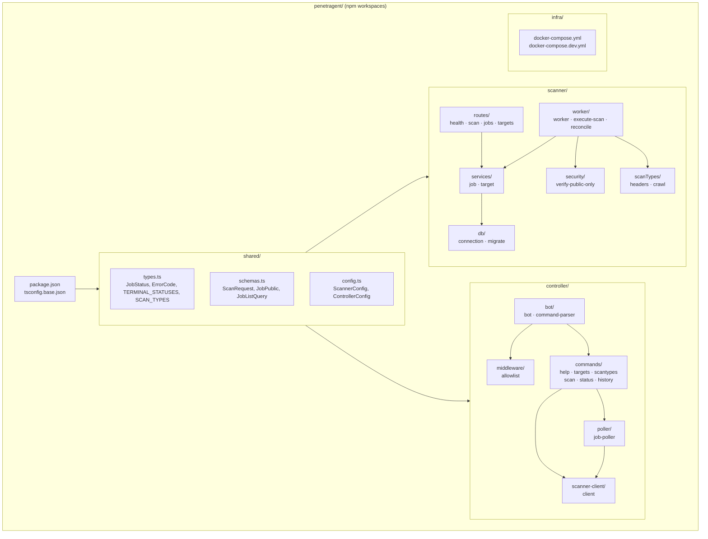

# Monorepo Structure

```mermaid
graph TB
    subgraph "penetragent/ (npm workspaces)"
        ROOT["package.json<br/>tsconfig.base.json"]

        subgraph "shared/"
            S_TYPES["types.ts<br/>JobStatus, ErrorCode, TERMINAL_STATUSES, SCAN_TYPES"]
            S_SCHEMAS["schemas.ts<br/>ScanRequest, JobPublic, JobListQuery"]
            S_CONFIG["config.ts<br/>ScannerConfig, ControllerConfig"]
        end

        subgraph "scanner/"
            S_ROUTES["routes/<br/>health · scan · jobs · targets"]
            S_SERVICES["services/<br/>job · target"]
            S_DB["db/<br/>connection · migrate"]
            S_WORKER["worker/<br/>worker · execute-scan · reconcile"]
            S_SECURITY["security/<br/>verify-public-only"]
            S_SCANTYPES["scanTypes/<br/>headers · crawl"]
        end

        subgraph "controller/"
            C_BOT["bot/<br/>bot · command-parser"]
            C_MW["middleware/<br/>allowlist"]
            C_CMDS["commands/<br/>help · targets · scantypes<br/>scan · status · history"]
            C_CLIENT["scanner-client/<br/>client"]
            C_POLLER["poller/<br/>job-poller"]
        end

        subgraph "infra/"
            COMPOSE["docker-compose.yml<br/>docker-compose.dev.yml"]
        end
    end

    ROOT --> shared/
    shared/ --> scanner/
    shared/ --> controller/
    S_ROUTES --> S_SERVICES
    S_SERVICES --> S_DB
    S_WORKER --> S_SERVICES
    S_WORKER --> S_SECURITY
    S_WORKER --> S_SCANTYPES
    C_BOT --> C_MW
    C_BOT --> C_CMDS
    C_CMDS --> C_CLIENT
    C_CMDS --> C_POLLER
    C_POLLER --> C_CLIENT
```
