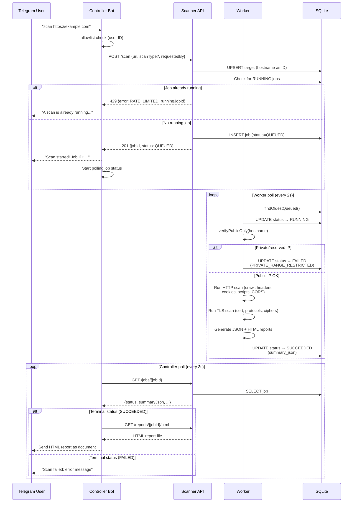
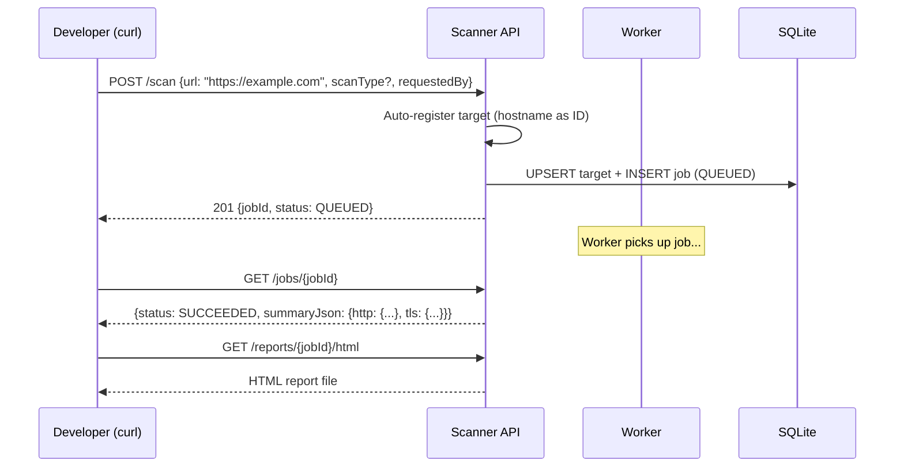
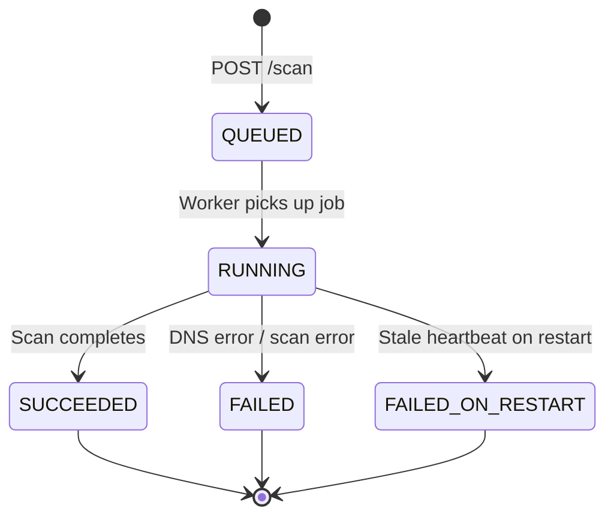

# Scan Workflow

## Controller to Scanner Sequence

```mermaid
sequenceDiagram
    participant U as Telegram User
    participant C as Controller Bot
    participant S as Scanner API
    participant W as Worker
    participant DB as SQLite

    U->>C: "scan https://example.com"
    C->>C: allowlist check (user ID)
    C->>S: POST /scan {url, scanType?, requestedBy}
    S->>DB: UPSERT target (hostname as ID)
    S->>DB: Check for RUNNING jobs
    alt Job already running
        S-->>C: 429 {error: RATE_LIMITED, runningJobId}
        C-->>U: "A scan is already running..."
    else No running job
        S->>DB: INSERT job (status=QUEUED)
        S-->>C: 201 {jobId, status: QUEUED}
        C-->>U: "Scan started! Job ID: ..."
        C->>C: Start polling job status
    end

    loop Worker poll (every 2s)
        W->>DB: findOldestQueued()
        W->>DB: UPDATE status → RUNNING
        W->>W: verifyPublicOnly(hostname)
        alt Private/reserved IP
            W->>DB: UPDATE status → FAILED<br/>(PRIVATE_RANGE_RESTRICTED)
        else Public IP OK
            W->>W: Run HTTP scan (crawl, headers,<br/>cookies, scripts, CORS)
            W->>W: Run TLS scan (cert, protocols, ciphers)
            W->>W: Generate JSON + HTML reports
            W->>DB: UPDATE status → SUCCEEDED<br/>(summary_json)
        end
    end

    loop Controller poll (every 3s)
        C->>S: GET /jobs/{jobId}
        S->>DB: SELECT job
        S-->>C: {status, summaryJson, ...}
        alt Terminal status (SUCCEEDED)
            C->>S: GET /reports/{jobId}/html
            S-->>C: HTML report file
            C-->>U: Send HTML report as document
        else Terminal status (FAILED)
            C-->>U: "Scan failed: error message"
        end
    end
```

## Direct curl Workflow

```mermaid
sequenceDiagram
    participant D as Developer (curl)
    participant S as Scanner API
    participant W as Worker
    participant DB as SQLite

    D->>S: POST /scan {url: "https://example.com", scanType?, requestedBy}
    S->>S: Auto-register target (hostname as ID)
    S->>DB: UPSERT target + INSERT job (QUEUED)
    S-->>D: 201 {jobId, status: QUEUED}

    Note over W: Worker picks up job...

    D->>S: GET /jobs/{jobId}
    S-->>D: {status: SUCCEEDED, summaryJson: {http: {...}, tls: {...}}}

    D->>S: GET /reports/{jobId}/html
    S-->>D: HTML report file
```

## Job State Machine

```mermaid
stateDiagram-v2
    [*] --> QUEUED: POST /scan
    QUEUED --> RUNNING: Worker picks up job
    RUNNING --> SUCCEEDED: Scan completes
    RUNNING --> FAILED: DNS error / scan error
    RUNNING --> FAILED_ON_RESTART: Stale heartbeat on restart
    SUCCEEDED --> [*]
    FAILED --> [*]
    FAILED_ON_RESTART --> [*]
```
