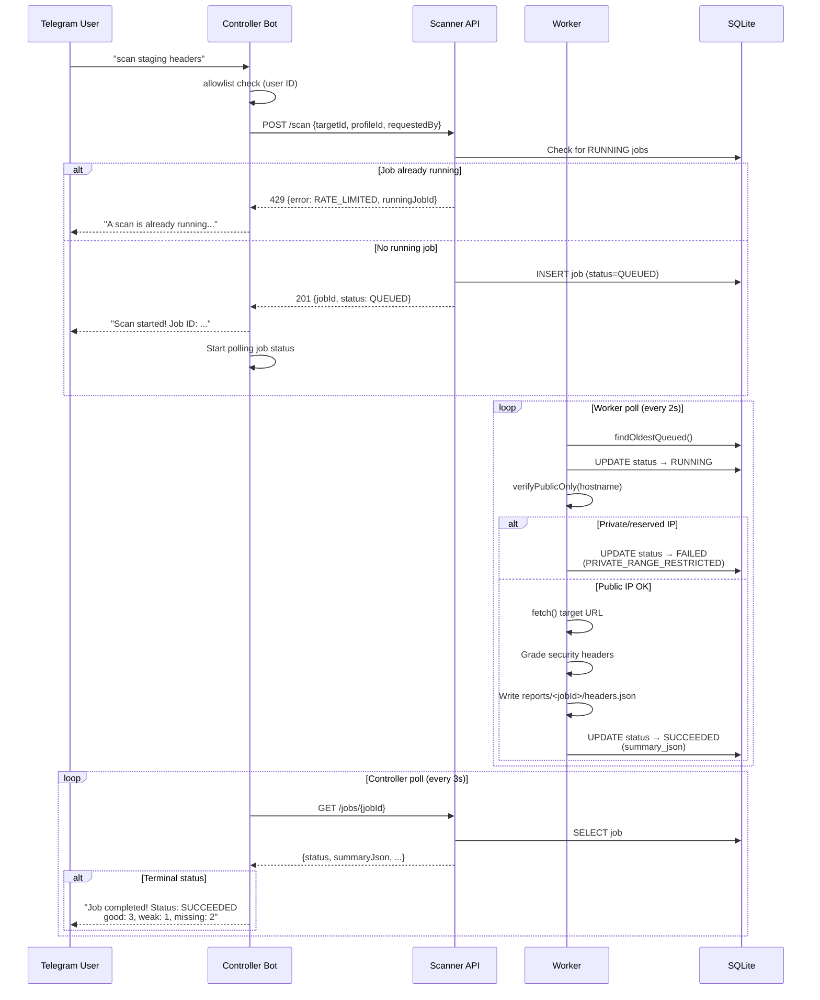
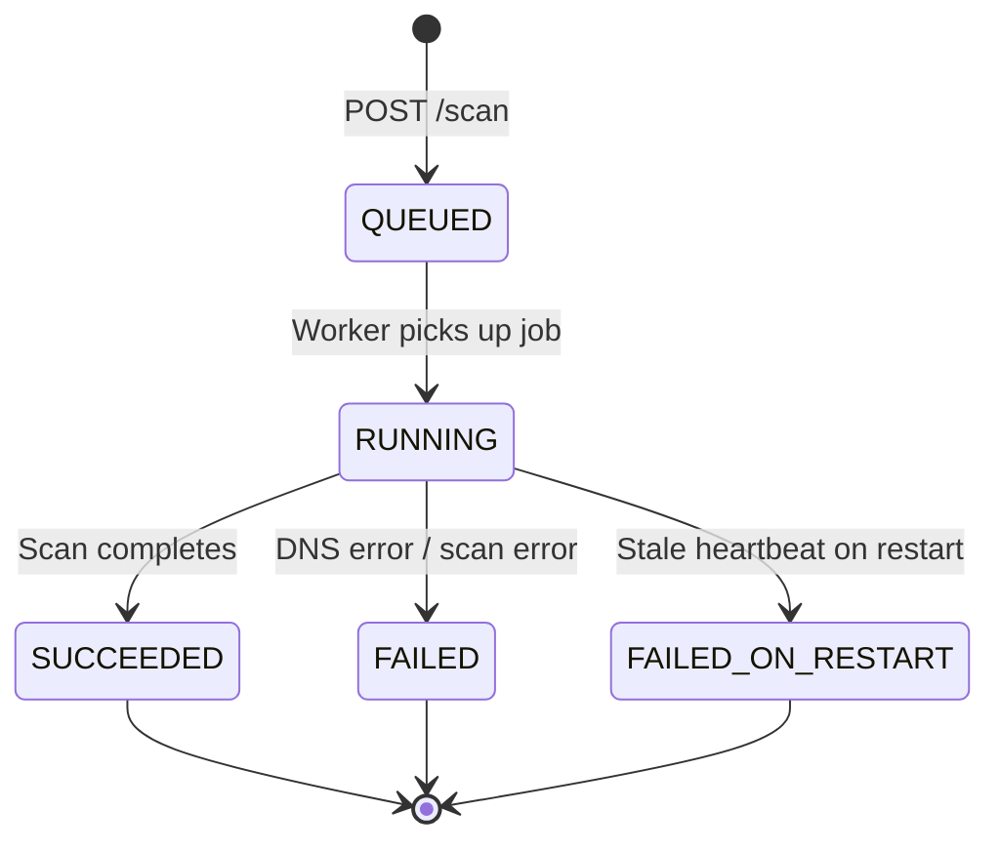

# Scan Workflow

## Controller to Scanner Sequence

```mermaid
sequenceDiagram
    participant U as Telegram User
    participant C as Controller Bot
    participant S as Scanner API
    participant W as Worker
    participant DB as SQLite

    U->>C: "scan staging headers"
    C->>C: allowlist check (user ID)
    C->>S: POST /scan {targetId, profileId, requestedBy}
    S->>DB: Check for RUNNING jobs
    alt Job already running
        S-->>C: 429 {error: RATE_LIMITED, runningJobId}
        C-->>U: "A scan is already running..."
    else No running job
        S->>DB: INSERT job (status=QUEUED)
        S-->>C: 201 {jobId, status: QUEUED}
        C-->>U: "Scan started! Job ID: ..."
        C->>C: Start polling job status
    end

    loop Worker poll (every 2s)
        W->>DB: findOldestQueued()
        W->>DB: UPDATE status → RUNNING
        W->>W: verifyPublicOnly(hostname)
        alt Private/reserved IP
            W->>DB: UPDATE status → FAILED<br/>(PRIVATE_RANGE_RESTRICTED)
        else Public IP OK
            W->>W: fetch() target URL
            W->>W: Grade security headers
            W->>W: Write reports/<jobId>/headers.json
            W->>DB: UPDATE status → SUCCEEDED<br/>(summary_json)
        end
    end

    loop Controller poll (every 3s)
        C->>S: GET /jobs/{jobId}
        S->>DB: SELECT job
        S-->>C: {status, summaryJson, ...}
        alt Terminal status
            C-->>U: "Job completed! Status: SUCCEEDED<br/>good: 3, weak: 1, missing: 2"
        end
    end
```

## Job State Machine

```mermaid
stateDiagram-v2
    [*] --> QUEUED: POST /scan
    QUEUED --> RUNNING: Worker picks up job
    RUNNING --> SUCCEEDED: Scan completes
    RUNNING --> FAILED: DNS error / scan error
    RUNNING --> FAILED_ON_RESTART: Stale heartbeat on restart
    SUCCEEDED --> [*]
    FAILED --> [*]
    FAILED_ON_RESTART --> [*]
```
