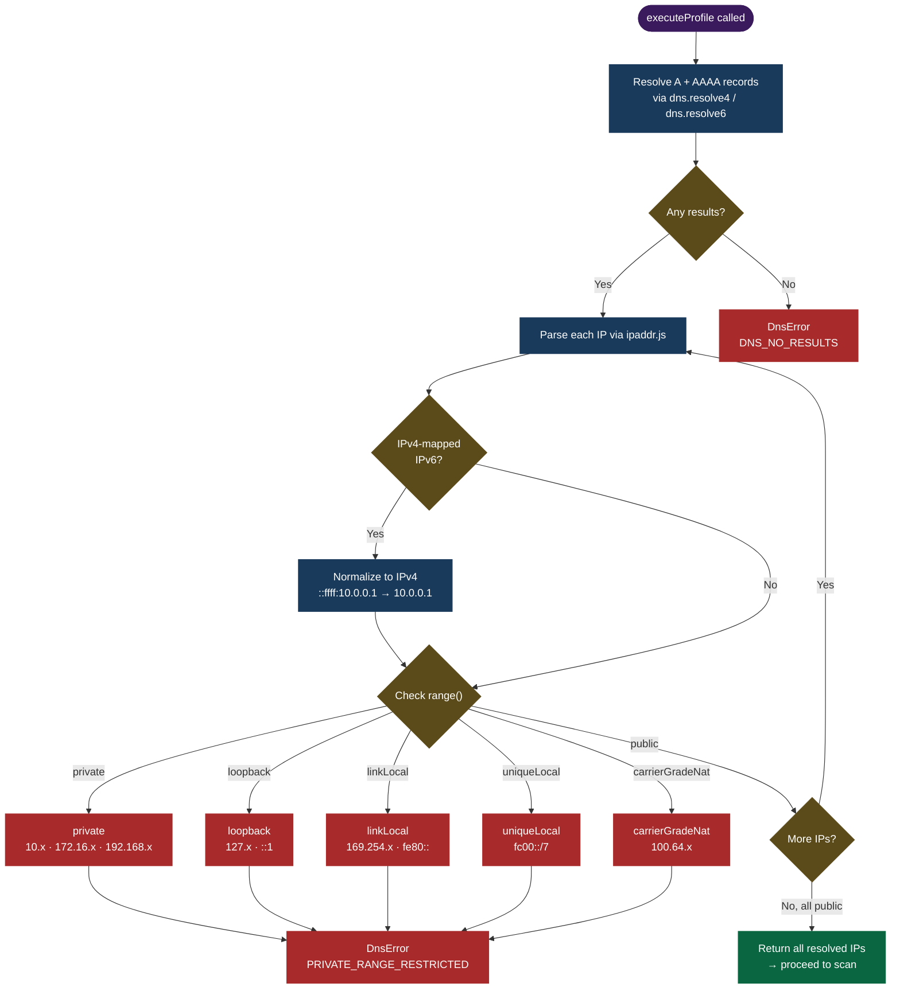

# SSRF Prevention Gate

This is the most safety-critical code in the project. Every hostname must pass through `verifyPublicOnly` before any outbound HTTP request is made.

```mermaid
flowchart TD
    classDef allow fill:#0a6640,color:#ffffff,stroke:#0a6640
    classDef reject fill:#a82a2a,color:#ffffff,stroke:#a82a2a
    classDef process fill:#1a3a5c,color:#ffffff,stroke:#1a3a5c
    classDef decision fill:#5c4b1a,color:#ffffff,stroke:#5c4b1a
    classDef input fill:#3a1a5c,color:#ffffff,stroke:#3a1a5c

    START([executeProfile called]):::input
    DNS["Resolve A + AAAA records<br/>via dns.resolve4 / dns.resolve6"]:::process
    EMPTY{Any results?}:::decision
    PARSE["Parse each IP via ipaddr.js"]:::process
    MAPPED{IPv4-mapped<br/>IPv6?}:::decision
    NORMALIZE["Normalize to IPv4<br/>::ffff:10.0.0.1 → 10.0.0.1"]:::process
    RANGE{"Check range()"}:::decision

    PRIVATE["private<br/>10.x · 172.16.x · 192.168.x"]:::reject
    LOOPBACK["loopback<br/>127.x · ::1"]:::reject
    LINKLOCAL["linkLocal<br/>169.254.x · fe80::"]:::reject
    ULA["uniqueLocal<br/>fc00::/7"]:::reject
    CGNAT["carrierGradeNat<br/>100.64.x"]:::reject

    MORE{More IPs?}:::decision
    PASS["Return all resolved IPs<br/>→ proceed to scan"]:::allow
    FAIL_DNS["DnsError<br/>DNS_NO_RESULTS"]:::reject
    FAIL_PRIVATE["DnsError<br/>PRIVATE_RANGE_RESTRICTED"]:::reject

    START --> DNS
    DNS --> EMPTY
    EMPTY -- "No" --> FAIL_DNS
    EMPTY -- "Yes" --> PARSE
    PARSE --> MAPPED
    MAPPED -- "Yes" --> NORMALIZE --> RANGE
    MAPPED -- "No" --> RANGE
    RANGE -- "private" --> PRIVATE --> FAIL_PRIVATE
    RANGE -- "loopback" --> LOOPBACK --> FAIL_PRIVATE
    RANGE -- "linkLocal" --> LINKLOCAL --> FAIL_PRIVATE
    RANGE -- "uniqueLocal" --> ULA --> FAIL_PRIVATE
    RANGE -- "carrierGradeNat" --> CGNAT --> FAIL_PRIVATE
    RANGE -- "public" --> MORE
    MORE -- "Yes" --> PARSE
    MORE -- "No, all public" --> PASS
```
