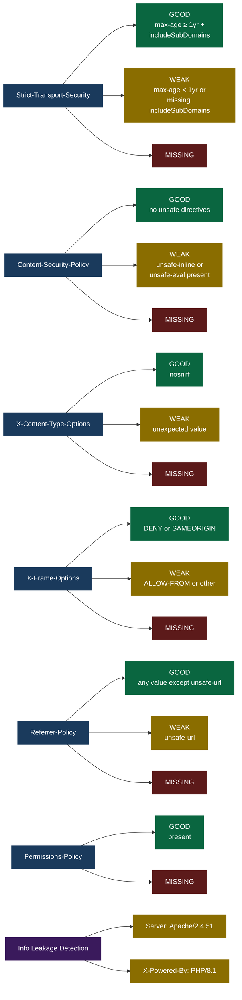
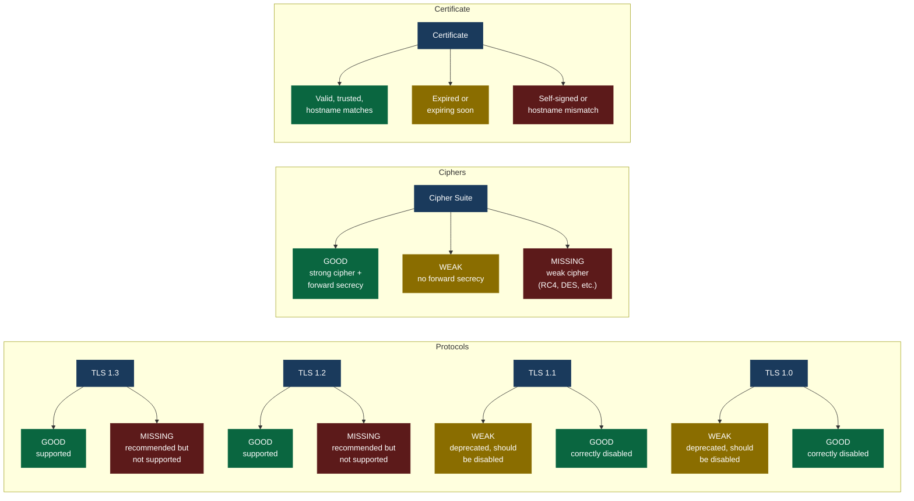

# Security Analysis Grading

## HTTP Header Grading Rules

## Additional HTTP Checks

Beyond header grading, the HTTP scan also analyzes:

- **Cookies** — Checks each Set-Cookie for Secure, HttpOnly, and SameSite attributes
- **External Scripts** — Identifies scripts missing Subresource Integrity (SRI) hashes
- **CORS** — Tests for wildcard origins, origin reflection, and credential misconfiguration
- **Technology Detection** — Identifies frameworks and CMS platforms from meta tags and headers

## TLS Grading Rules

