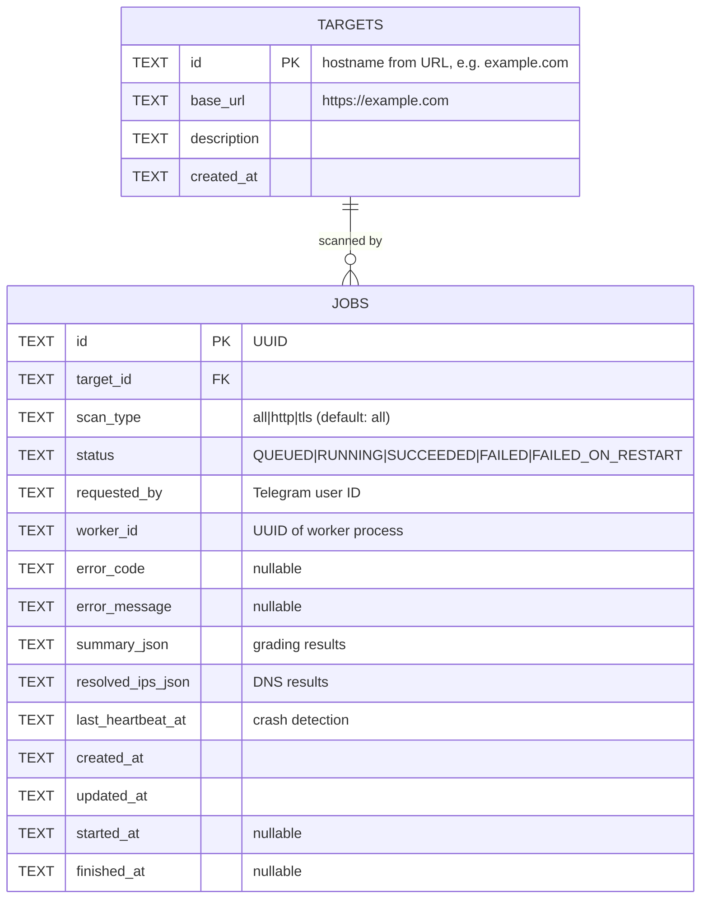

# Database Schema

Targets are auto-registered when a `url` is passed to `POST /scan` (the hostname becomes the ID). No targets are seeded at startup.

```mermaid
erDiagram
    TARGETS {
        TEXT id PK "hostname from URL, e.g. example.com"
        TEXT base_url "https://example.com"
        TEXT description
        TEXT created_at
    }
    JOBS {
        TEXT id PK "UUID"
        TEXT target_id FK
        TEXT scan_type "all|http|tls (default: all)"
        TEXT status "QUEUED|RUNNING|SUCCEEDED|FAILED|FAILED_ON_RESTART"
        TEXT requested_by "Telegram user ID"
        TEXT worker_id "UUID of worker process"
        TEXT error_code "nullable"
        TEXT error_message "nullable"
        TEXT summary_json "grading results"
        TEXT resolved_ips_json "DNS results"
        TEXT last_heartbeat_at "crash detection"
        TEXT created_at
        TEXT updated_at
        TEXT started_at "nullable"
        TEXT finished_at "nullable"
    }

    TARGETS ||--o{ JOBS : "scanned by"
```
