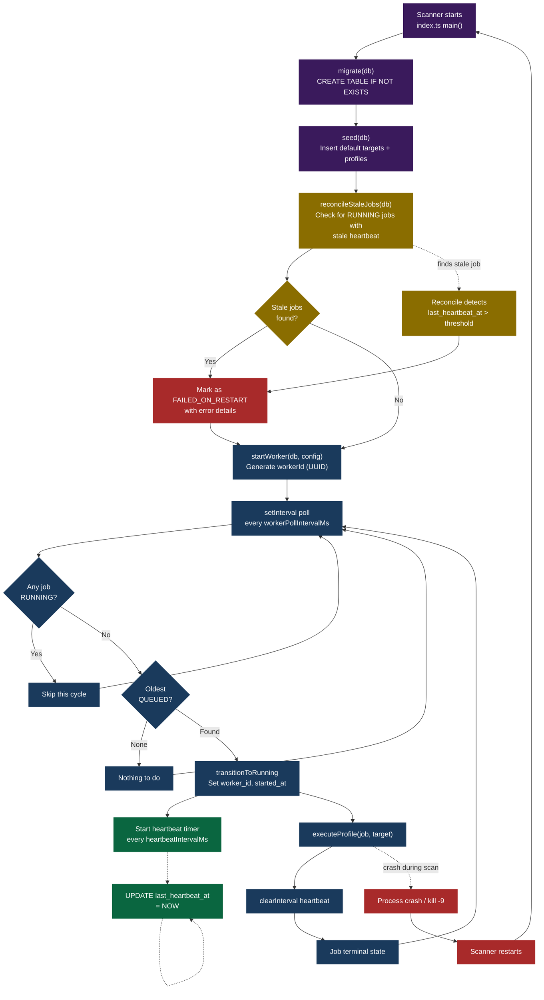

# Worker Lifecycle & Crash Recovery

```mermaid
flowchart TD
    classDef startup fill:#3a1a5c,color:#ffffff,stroke:#3a1a5c
    classDef normal fill:#1a3a5c,color:#ffffff,stroke:#1a3a5c
    classDef heartbeat fill:#0a6640,color:#ffffff,stroke:#0a6640
    classDef crash fill:#a82a2a,color:#ffffff,stroke:#a82a2a
    classDef recovery fill:#8a6d00,color:#ffffff,stroke:#8a6d00

    BOOT["Scanner starts<br/>index.ts main()"]:::startup
    MIGRATE["migrate(db)<br/>CREATE TABLE IF NOT EXISTS"]:::startup
    SEED["seed(db)<br/>Insert default targets + profiles"]:::startup
    RECONCILE["reconcileStaleJobs(db)<br/>Check for RUNNING jobs with<br/>stale heartbeat"]:::recovery

    STALE{Stale jobs<br/>found?}:::recovery
    MARK["Mark as FAILED_ON_RESTART<br/>with error details"]:::crash
    START_WORKER["startWorker(db, config)<br/>Generate workerId (UUID)"]:::normal

    POLL_LOOP["setInterval poll<br/>every workerPollIntervalMs"]:::normal
    CHECK_RUNNING{Any job<br/>RUNNING?}:::normal
    SKIP["Skip this cycle"]:::normal
    FIND_QUEUED{Oldest<br/>QUEUED?}:::normal
    IDLE["Nothing to do"]:::normal

    CLAIM["transitionToRunning<br/>Set worker_id, started_at"]:::normal
    HB_START["Start heartbeat timer<br/>every heartbeatIntervalMs"]:::heartbeat
    HB_TICK["UPDATE last_heartbeat_at<br/>= NOW"]:::heartbeat
    EXECUTE["executeProfile(job, target)"]:::normal
    HB_STOP["clearInterval heartbeat"]:::normal
    DONE["Job terminal state"]:::normal

    CRASH["Process crash / kill -9"]:::crash
    RESTART["Scanner restarts"]:::crash
    DETECT["Reconcile detects<br/>last_heartbeat_at > threshold"]:::recovery

    BOOT --> MIGRATE --> SEED --> RECONCILE
    RECONCILE --> STALE
    STALE -- "Yes" --> MARK --> START_WORKER
    STALE -- "No" --> START_WORKER
    START_WORKER --> POLL_LOOP
    POLL_LOOP --> CHECK_RUNNING
    CHECK_RUNNING -- "Yes" --> SKIP --> POLL_LOOP
    CHECK_RUNNING -- "No" --> FIND_QUEUED
    FIND_QUEUED -- "None" --> IDLE --> POLL_LOOP
    FIND_QUEUED -- "Found" --> CLAIM --> HB_START
    HB_START -.-> HB_TICK -.-> HB_TICK
    CLAIM --> EXECUTE --> HB_STOP --> DONE --> POLL_LOOP

    EXECUTE -. "crash during scan" .-> CRASH
    CRASH --> RESTART --> BOOT
    RECONCILE -. "finds stale job" .-> DETECT --> MARK
```
