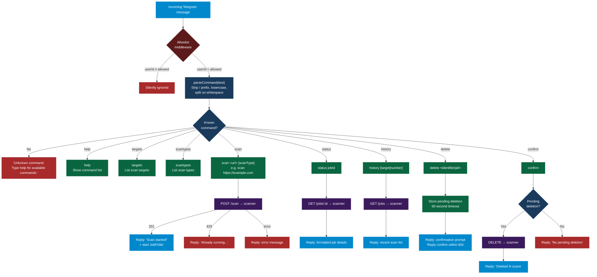

# Telegram Command Routing

```mermaid
flowchart TD
    classDef telegram fill:#0088cc,color:#ffffff,stroke:#0088cc
    classDef middleware fill:#5c1a1a,color:#ffffff,stroke:#5c1a1a
    classDef parser fill:#1a3a5c,color:#ffffff,stroke:#1a3a5c
    classDef command fill:#0a6640,color:#ffffff,stroke:#0a6640
    classDef error fill:#a82a2a,color:#ffffff,stroke:#a82a2a
    classDef scanner fill:#3a1a5c,color:#ffffff,stroke:#3a1a5c

    MSG["Incoming Telegram message"]:::telegram
    ALLOW{Allowlist<br/>middleware}:::middleware
    DROP["Silently ignored"]:::error
    PARSE["parseCommand(text)<br/>Strip / prefix, lowercase,<br/>split on whitespace"]:::parser
    KNOWN{Known<br/>command?}:::parser
    UNKNOWN["'Unknown command.<br/>Type help for available commands.'"]:::error

    HELP["help<br/>Show command list"]:::command
    TARGETS["targets<br/>List scan targets"]:::command
    SCANTYPES["scantypes<br/>List scan types"]:::command
    SCAN["scan &lt;url&gt; [scanType]<br/>e.g. scan https://example.com"]:::command
    STATUS["status jobId"]:::command
    HISTORY["history [target|number]"]:::command
    DELETE["delete &lt;identifier|all&gt;"]:::command
    CONFIRM["confirm"]:::command

    SCAN_API["POST /scan → scanner"]:::scanner
    SCAN_OK["Reply: 'Scan started!'<br/>+ start JobPoller"]:::telegram
    SCAN_429["Reply: 'Already running...'"]:::error
    SCAN_ERR["Reply: error message"]:::error

    STATUS_API["GET /jobs/:id → scanner"]:::scanner
    STATUS_OK["Reply: formatted job details"]:::telegram
    HISTORY_API["GET /jobs → scanner"]:::scanner
    HISTORY_OK["Reply: recent scan list"]:::telegram

    DELETE_PENDING["Store pending deletion<br/>60-second timeout"]:::command
    DELETE_PROMPT["Reply: confirmation prompt<br/>'Reply confirm within 60s'"]:::telegram

    CONFIRM_CHECK{Pending<br/>deletion?}:::parser
    CONFIRM_DELETE["DELETE → scanner"]:::scanner
    CONFIRM_OK["Reply: 'Deleted N scans'"]:::telegram
    CONFIRM_NONE["Reply: 'No pending deletion'"]:::error

    MSG --> ALLOW
    ALLOW -- "userId ≠ allowed" --> DROP
    ALLOW -- "userId = allowed" --> PARSE
    PARSE --> KNOWN
    KNOWN -- "No" --> UNKNOWN
    KNOWN -- "help" --> HELP
    KNOWN -- "targets" --> TARGETS
    KNOWN -- "scantypes" --> SCANTYPES
    KNOWN -- "scan" --> SCAN
    KNOWN -- "status" --> STATUS
    KNOWN -- "history" --> HISTORY
    KNOWN -- "delete" --> DELETE
    KNOWN -- "confirm" --> CONFIRM

    SCAN --> SCAN_API
    SCAN_API -- "201" --> SCAN_OK
    SCAN_API -- "429" --> SCAN_429
    SCAN_API -- "error" --> SCAN_ERR

    STATUS --> STATUS_API --> STATUS_OK
    HISTORY --> HISTORY_API --> HISTORY_OK

    DELETE --> DELETE_PENDING --> DELETE_PROMPT
    CONFIRM --> CONFIRM_CHECK
    CONFIRM_CHECK -- "Yes" --> CONFIRM_DELETE --> CONFIRM_OK
    CONFIRM_CHECK -- "No" --> CONFIRM_NONE
```
