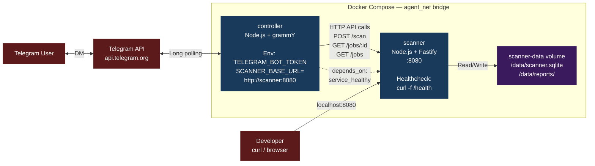

# Docker Network Architecture

```mermaid
flowchart LR
    classDef external fill:#5c1a1a,color:#ffffff,stroke:#5c1a1a
    classDef container fill:#1a3a5c,color:#ffffff,stroke:#1a3a5c
    classDef volume fill:#3a1a5c,color:#ffffff,stroke:#3a1a5c
    classDef network fill:#0a6640,color:#ffffff,stroke:#0a6640
    classDef api fill:#8a6d00,color:#ffffff,stroke:#8a6d00

    USER["Telegram User"]:::external
    TGAPI["Telegram API<br/>api.telegram.org"]:::external
    CURL["Developer<br/>curl / browser"]:::external

    subgraph DOCKER["Docker Compose — agent_net bridge"]
        direction TB

        CTRL["controller<br/>Node.js + grammY<br/><br/>Env: TELEGRAM_BOT_TOKEN<br/>SCANNER_BASE_URL=<br/>http://scanner:8080"]:::container

        SCAN["scanner<br/>Node.js + Fastify<br/>:8080<br/><br/>Healthcheck:<br/>curl -f /health"]:::container

        VOL["scanner-data volume<br/>/data/scanner.sqlite<br/>/data/reports/"]:::volume
    end

    USER <-- "DM" --> TGAPI
    TGAPI <-- "Long polling" --> CTRL
    CTRL -- "HTTP API calls<br/>POST /scan<br/>GET /jobs/:id<br/>GET /jobs" --> SCAN
    SCAN -- "Read/Write" --> VOL
    CURL -- "localhost:8080" --> SCAN

    CTRL -. "depends_on:<br/>service_healthy" .-> SCAN
```
