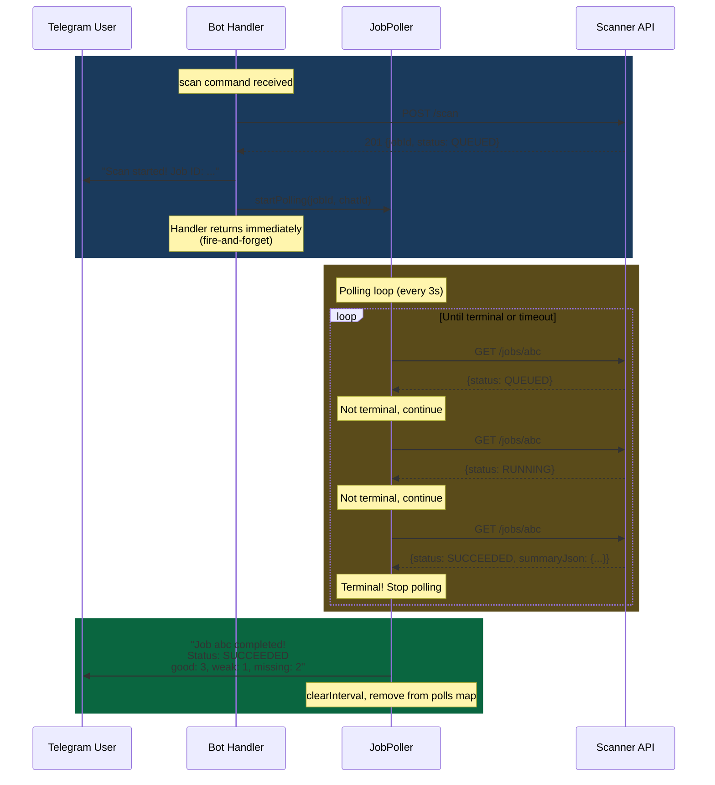

# Job Poller Async Flow

The scan command returns immediately to the user. A background poller watches for completion and delivers the result.

```mermaid
sequenceDiagram
    participant U as Telegram User
    participant B as Bot Handler
    participant P as JobPoller
    participant S as Scanner API

    rect rgb(26, 58, 92)
        Note over B: scan command received
        B->>S: POST /scan
        S-->>B: 201 {jobId, status: QUEUED}
        B->>U: "Scan started! Job ID: ..."
        B->>P: startPolling(jobId, chatId)
        Note over B: Handler returns immediately<br/>(fire-and-forget)
    end

    rect rgb(90, 75, 26)
        Note over P: Polling loop (every 3s)
        loop Until terminal or timeout
            P->>S: GET /jobs/abc
            S-->>P: {status: QUEUED}
            Note over P: Not terminal, continue
            P->>S: GET /jobs/abc
            S-->>P: {status: RUNNING}
            Note over P: Not terminal, continue
            P->>S: GET /jobs/abc
            S-->>P: {status: SUCCEEDED, summaryJson: {...}}
            Note over P: Terminal! Stop polling
        end
    end

    rect rgb(10, 102, 64)
        P->>U: "Job abc completed!<br/>Status: SUCCEEDED<br/>good: 3, weak: 1, missing: 2"
        Note over P: clearInterval, remove from polls map
    end
```
